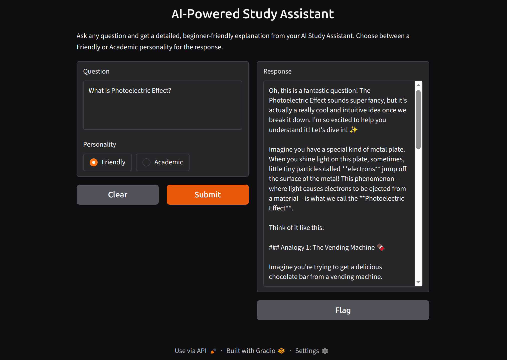

# 📚 AI Powered Study Assistant

An AI-powered Study Assistant built with **Python**, **Gradio**, and **Google Gemini 2.5 Flash**. It explains complex topics in a simple and interactive way while allowing users to choose different response styles through a clean web interface.

## 🖼️ Preview

<p align="center">
  
</p>

> Replace `screenshots/gradio-ui.png` with your screenshot after creating the `screenshots` folder.

## ✨ Features

- 🤖 Powered by Google Gemini 2.5 Flash
- 🎨 Interactive Gradio web interface
- 😊 Multiple AI personalities
  - Friendly
  - Academic
- 📖 Beginner-friendly explanations
- 🎯 Customizable response generation
- 🔐 Secure API key management using `.env`

## 🛠️ Tech Stack

- Python
- Gradio
- Google GenAI SDK
- Python Dotenv

## 📂 Project Structure

```text
Ai_Powered_Study_Assistant/
│── assistant.py
│── .env
│── .gitignore
│── requirements.txt
└── venv/
```

## ⚙️ Installation

### 1. Clone the repository

```bash
git clone <repository-url>
cd Ai_Powered_Study_Assistant
```

### 2. Create and activate a virtual environment

```bash
python -m venv venv

# Linux/macOS
source venv/bin/activate

# Windows
venv\Scripts\activate
```

### 3. Install dependencies

```bash
pip install -r requirements.txt
```

### 4. Create a `.env` file

```env
GENAI_API_KEY=your_api_key_here
```

## ▶️ Run

```bash
python assistant.py
```

The application will launch a **Gradio web interface** in your browser, where you can enter questions, choose a response style, and receive AI-generated explanations.

## 🖥️ Gradio UI

The application provides an intuitive web interface built with Gradio, making it easy to interact with the AI assistant without using the command line.


## 📌 Example

### Input

```
Explain Generative AI in simple terms.
```

### Output

```
Generative AI is like a creative assistant that learns patterns from existing data and uses them to generate new content such as text, images, or code...
```

## 🚨 Troubleshooting

### Installation Issues

If you encounter errors while installing dependencies (such as `tiktoken` requiring a Rust compiler), first upgrade `pip`, `setuptools`, and `wheel`:

```bash
python -m pip install --upgrade pip setuptools wheel
```

Then reinstall the dependencies:

```bash
pip install -r requirements.txt
```

If the issue persists, ensure you are using **Python 3.10–3.12** and the latest version of `pip`.

## 📄 License

This project is for educational purposes.
